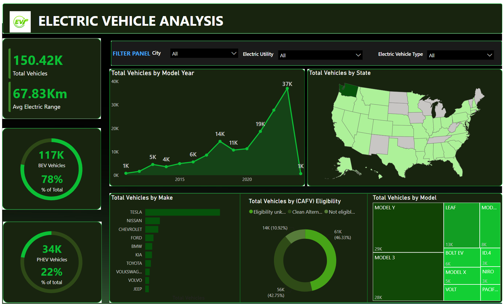

# Electric Vehicle Analysis

- Microsoft Power BI
- Power Query
- DAX
- Data Modeling
- Data Visualization

> Interactive business intelligence solution developed to analyze electric vehicle adoption trends, evaluate manufacturer performance, monitor Clean Alternative Fuel Vehicle (CAFV) eligibility, and provide actionable insights into the electric vehicle market through interactive dashboards and key performance indicators (KPIs).

---

## Dashboard Preview

The Power BI report consists of a single interactive dashboard designed to provide a comprehensive overview of electric vehicle adoption, manufacturer performance, vehicle eligibility, and market trends.

### Dashboard

---

## Business Problem

The objective of this project was to analyze the electric vehicle market by developing an interactive reporting solution that provides visibility into vehicle adoption trends, manufacturer performance, electric vehicle types, and Clean Alternative Fuel Vehicle (CAFV) eligibility.

The dashboard enables stakeholders to monitor market growth, compare electric vehicle manufacturers, evaluate vehicle distribution across states, analyze electric range performance, and support data-driven decisions through interactive visualizations and key performance indicators (KPIs).

---

## Project Objectives

The project was designed to:

- Monitor the overall electric vehicle market.
- Analyze electric vehicle adoption trends over time.
- Measure the average electric driving range.
- Compare Battery Electric Vehicles (BEVs) and Plug-in Hybrid Electric Vehicles (PHEVs).
- Evaluate manufacturer performance based on total vehicles.
- Analyze vehicle distribution across different states.
- Examine CAFV eligibility distribution.
- Identify the most popular electric vehicle models.
- Build an interactive Power BI dashboard to support business decision-making.

---

## Power Query

Before building the dashboard, the dataset was prepared using Power Query.

Power Query was used to:

- Inspect and understand the dataset structure.
- Clean and transform the data for analysis.
- Verify data types for accurate reporting.
- Prepare the dataset for data modeling.
- Prepare the dataset for interactive reporting and visualization in Power BI.

---

## Data Modeling

The dashboard was built using Power BI's data modeling capabilities to establish relationships between tables, enabling accurate calculations, efficient filtering, and interactive reporting across all visuals.

---
## DAX Measures

The following DAX measures were developed to support KPI reporting and interactive dashboard filtering:

- Total Vehicles
- Average Electric Range
- Total BEV Vehicles
- % of Total BEV Vehicles
- Total PHEV Vehicles
- % of Total PHEV Vehicles

---

## Dashboard Overview

The report consists of a single interactive dashboard.

### Electric Vehicle Dashboard

Provides a comprehensive overview of the electric vehicle market through key business KPIs, adoption trends, manufacturer performance, geographical distribution, CAFV eligibility, and vehicle model analysis.

---

## Dashboard Features

Key features of the dashboard include:

- Interactive slicers for City, Electric Utility, and Electric Vehicle Type.
- KPI cards for monitoring Total Vehicles and Average Electric Range.
- Visuals comparing the distribution of BEV and PHEV vehicles.
- Line chart illustrating electric vehicle adoption trends by model year.
- Filled map visualizing vehicle distribution across states.
- Bar chart comparing the top vehicle manufacturers.
- Doughnut chart analyzing CAFV eligibility.
- Treemap highlighting the most popular electric vehicle models.
- Cross-filtering across visuals for interactive data exploration.

---

## Business Impact

The dashboard provides stakeholders with a centralized view of the electric vehicle market, enabling them to monitor adoption trends, evaluate manufacturer performance, and understand market distribution across different regions.

It enables users to:

- Monitor the growth of electric vehicle adoption.
- Compare the market share of leading manufacturers.
- Analyze electric vehicle distribution by state.
- Evaluate the adoption of BEVs and PHEVs.
- Assess Clean Alternative Fuel Vehicle (CAFV) eligibility.
- Identify the most popular electric vehicle models.
- Support data-driven planning and decision-making through interactive reporting.

---

## Key Insights

The dashboard helps stakeholders quickly identify:

- Overall electric vehicle adoption.
- Average electric driving range.
- BEV and PHEV market distribution.
- Electric vehicle growth by model year.
- Leading vehicle manufacturers.
- Geographic distribution of electric vehicles across states.
- CAFV eligibility distribution.
- Most popular electric vehicle models.

---

## Key Skills Demonstrated

- Power BI
- Power Query
- Data Cleaning
- Data Modeling
- DAX
- Dashboard Design
- KPI Reporting
- Data Visualization
- Business Intelligence
- Interactive Reporting

---

## Repository Contents

- `electric-vehicle-analysis.pbix` – Interactive Power BI dashboard.
- `electric-vehicle-data.xlsx` – Dataset used for analysis.
- `Electric Vehicle Presentation.pdf` – Project problem statement and presentation.
- `images/electric-vehicle-analysis.png` – Dashboard preview.
- `README.md` – Project documentation.

---

## What I Learned

Through this project, I strengthened my Power BI skills by building an end-to-end business intelligence dashboard that transforms raw electric vehicle data into meaningful insights. I gained hands-on experience creating DAX measures, designing interactive visualizations, implementing data modeling techniques, and developing dashboards that communicate business insights effectively.

I also improved my understanding of dashboard layout, user experience, and visual storytelling by designing a report that allows stakeholders to explore electric vehicle trends through interactive filtering and dynamic visuals.

---

## Future Improvements

Future enhancements may include:

- Adding Year-to-Date (YTD) and Month-to-Date (MTD) trend analysis.

---

## About This Project

This project was developed as part of my data analytics learning journey to strengthen my Power BI skills through a real-world electric vehicle market analysis scenario.

The project demonstrates the complete Power BI workflow, from data preparation in Power Query and data modeling to DAX calculations and interactive dashboard development. It showcases the use of business intelligence techniques to transform raw data into meaningful insights through effective visualization and reporting.

While the dataset is publicly available for educational purposes, all Power Query transformations, DAX calculations, dashboard design, data modeling, and project documentation were completed independently as part of my portfolio.
